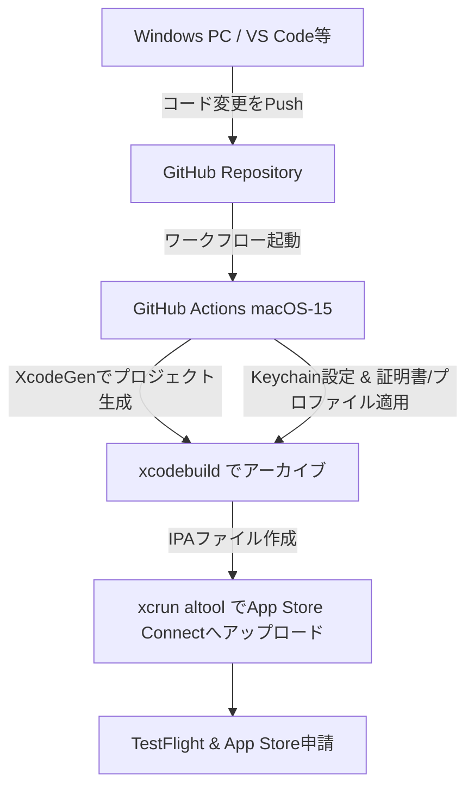

# Macなし大学生がGitHub ActionsでiOSアプリをApp Store公開した話（SwiftData＋キーチェーン生体認証）

## はじめに
こんにちは！大学生の sl21ku です。

就活が本格化する中、増え続ける各社の「マイページURL」「ログインID」「パスワード」「選考ステータス」「ES（エントリーシート）の文章」を管理するのに頭を悩ませていました。
世の中には様々な管理ツールがありますが、**就活情報やマイページのパスワードは超個人情報**です。外部の不審なサーバーに送信されたり、平文のメモ帳で管理したりするのはセキュリティ的に避けたいと考えました。

そこで、**「完全ローカル完結（ローカルファースト）」「パスワードは生体認証（Face ID）必須のキーチェーン保存」「スクショから自動で文字起こし(OCR)」**という自分好みのiOSアプリ**「就活ボード（Shukatsu Board）」**を自作しました。

しかし、大きな問題がありました。**私はMacを持っていません。手元にあるのはWindows PCのみです。**
「MacがないとiOSアプリの開発・リリースは無理では？」と思われがちですが、**GitHub ActionsのmacOSランナー**をフル活用することで、1円もクラウドMacのレンタル代を払わずに、無事App Storeへの申請・リリースまでこぎつけることができました。

本記事では、そのアーキテクチャやGitHub Actionsでの自動ビルド・署名・アップロードのノウハウを共有します。

---

## 1. アプリの構成と技術スタック
アプリは以下のようなローカルファーストかつ実用的な構成で実装しました。

* **UI:** SwiftUI
* **データベース:** SwiftData (iOS 17+)
* **セキュリティ:** `Security` フレームワーク（キーチェーン保存） ＋ `LocalAuthentication` （Face ID / Touch ID / 端末パスコード）
* **OCR文字起こし:** `Vision` フレームワーク（完全に端末内処理）
* **カレンダー連携:** `EventKit`（説明会や面接の日程を標準カレンダーに自動挿入）
* **ブラウザ連携:** Share Extension（Safari等で企業のマイページを開いている時、共有メニューからワンタップで企業情報を取り込む）
* **プロジェクト管理:** XcodeGen (`project.yml`)

### セキュリティ面でのこだわり
1. **パスワードはDBに置かない**
   企業マイページのパスワード本文はSwiftData（SQLite）には保存せず、iOSの最も安全な領域である「キーチェーン」に格納します。
2. **生体認証による保護**
   パスワードを表示、またはクリップボードにコピーする際は、必ずFace IDやTouch IDによる生体認証（またはパスコード）を求めます。
3. **クリップボード自動消去**
   コピーしたパスワードがクリップボードに残ったまま他のアプリに盗み見られるのを防ぐため、コピー後一定時間で自動クリアする処理を入れました。

---

## 2. MacなしでiOSビルド・署名・アップロードを実現する仕組み
通常、iOSアプリのビルドやApp Storeへの提出にはMacとXcodeが必須です。
今回は、Windows上でコードを書き、**GitHub Actions (macos-15ランナー)** にコンパイル・署名・TestFlight/App Storeへの提出をすべて委託しました。

全体の連携イメージは以下の通りです。



### ハマりポイント①：Macがないのにどうやって「証明書」と「秘密鍵」を作るか？
Appleの署名に必要な `ios_distribution.cer` や秘密鍵（.p12形式）は、通常Macの「キーチェーンアクセス」アプリで作ります。
しかし、Windowsでも **Git Bashに付属している `openssl`** を使えば問題なく作成可能です。

```bash
# 1. 秘密鍵の作成
openssl genrsa -out ios_distribution.key 2048

# 2. CSR（証明書署名要求）ファイルの作成
openssl req -new -key ios_distribution.key -out ios_distribution.csr -subj "/emailAddress=自分のメール, CN=自分の名前, C=JP"
```

作成した `.csr` ファイルをWindowsのブラウザからApple Developer Portalにアップロードし、発行された `.cer` 証明書をダウンロードします。その後、ローカルのOpenSSLで `.p12` 形式（鍵と証明書がセットになったもの）に変換します。

```bash
openssl x509 -in ios_distribution.cer -inform DER -out ios_distribution.pem -outform PEM
openssl pkcs12 -export -inkey ios_distribution.key -in ios_distribution.pem -out ios_distribution.p12 -passout pass:任意のパスワード
```

これで署名に必要な `.p12` ファイルが手に入りました。これをBase64エンコードして、GitHubの「Repository Secrets」に保存します。

---

## 3. GitHub Actionsのワークフロー実装
以下が、実際にビルドからApp Store Connectへのアップロードまでを自動化した `.github/workflows/ios-release.yml` です。

```yaml
name: iOS TestFlight Release

on:
  workflow_dispatch:

jobs:
  release:
    name: Build and Upload to TestFlight
    runs-on: macos-15
    timeout-minutes: 35

    steps:
      - name: Checkout repository
        uses: actions/checkout@v4

      - name: Select latest Xcode version
        run: |
          LATEST_XCODE=$(ls -d /Applications/Xcode_*.app | sort -V | tail -n 1)
          sudo xcode-select -s "$LATEST_XCODE"
          xcodebuild -version

      - name: Install XcodeGen
        run: brew install xcodegen

      # Appleは同じビルド番号の再アップロードを拒否するため、
      # GitHubのrun_numberを使ってビルド番号を自動インクリメントします。
      - name: Update build number
        run: |
          sed -i '' 's/CURRENT_PROJECT_VERSION: "1"/CURRENT_PROJECT_VERSION: "${{ github.run_number }}"/g' project.yml

      - name: Generate Xcode project
        run: xcodegen generate

      - name: Install Apple Certificate and Provisioning Profiles
        env:
          BUILD_CERTIFICATE_BASE64: ${{ secrets.BUILD_CERTIFICATE_BASE64 }}
          P12_PASSWORD: ${{ secrets.P12_PASSWORD }}
          BUILD_PROVISION_PROFILE_BASE64_MAIN: ${{ secrets.BUILD_PROVISION_PROFILE_BASE64_MAIN }}
          BUILD_PROVISION_PROFILE_BASE64_SHARE: ${{ secrets.BUILD_PROVISION_PROFILE_BASE64_SHARE }}
          KEYCHAIN_PASSWORD: "temporary_keychain_password"
        run: |
          CERTIFICATE_PATH=$RUNNER_TEMP/build_certificate.p12
          PP_PATH_MAIN=$RUNNER_TEMP/main.mobileprovision
          PP_PATH_SHARE=$RUNNER_TEMP/share.mobileprovision
          KEYCHAIN_PATH=$RUNNER_TEMP/app-signing.keychain-db

          echo -n "$BUILD_CERTIFICATE_BASE64" | base64 --decode -o $CERTIFICATE_PATH
          echo -n "$BUILD_PROVISION_PROFILE_BASE64_MAIN" | base64 --decode -o $PP_PATH_MAIN
          echo -n "$BUILD_PROVISION_PROFILE_BASE64_SHARE" | base64 --decode -o $PP_PATH_SHARE

          # 一時キーチェーンを作成してインポート
          security create-keychain -p "$KEYCHAIN_PASSWORD" $KEYCHAIN_PATH
          security default-keychain -s $KEYCHAIN_PATH
          security unlock-keychain -p "$KEYCHAIN_PASSWORD" $KEYCHAIN_PATH
          security set-keychain-settings -t 3600 -u $KEYCHAIN_PATH

          security import $CERTIFICATE_PATH -P "$P12_PASSWORD" -A -t cert -f pkcs12 -k $KEYCHAIN_PATH
          security list-keychain -d user -s $KEYCHAIN_PATH

          # プロビジョニングプロファイルを配置
          mkdir -p ~/Library/MobileDevice/Provisioning\ Profiles
          cp $PP_PATH_MAIN ~/Library/MobileDevice/Provisioning\ Profiles/
          cp $PP_PATH_SHARE ~/Library/MobileDevice/Provisioning\ Profiles/

      - name: Create ExportOptions.plist
        run: |
          cat <<EOF > ExportOptions.plist
          <?xml version="1.0" encoding="UTF-8"?>
          <!DOCTYPE plist PUBLIC "-//Apple//DTD PLIST 1.0//EN" "http://www.apple.com/DTDs/PropertyList-1.0.dtd">
          <plist version="1.0">
          <dict>
              <key>destination</key>
              <string>export</string>
              <key>manageAppVersionAndBuildNumber</key>
              <true/>
              <key>method</key>
              <string>app-store</string>
              <key>provisioningProfiles</key>
              <dict>
                  <key>com.sl21ku.ShukatsuBoard</key>
                  <string>ShukatsuBoard App Store</string>
                  <key>com.sl21ku.ShukatsuBoard.ShareExtension</key>
                  <string>ShukatsuBoard Share App Store</string>
              </dict>
              <key>signingCertificate</key>
              <string>Apple Distribution</string>
              <key>signingStyle</key>
              <string>manual</string>
              <key>teamID</key>
              <string>69A95U4T99</string>
          </dict>
          </plist>
          EOF

      - name: Build and Archive
        run: |
          xcodebuild \
            -project ShukatsuBoard.xcodeproj \
            -scheme ShukatsuBoard \
            -sdk iphoneos \
            -configuration Release \
            -archivePath $RUNNER_TEMP/ShukatsuBoard.xcarchive \
            archive

      - name: Export IPA
        run: |
          xcodebuild \
            -exportArchive \
            -archivePath $RUNNER_TEMP/ShukatsuBoard.xcarchive \
            -exportOptionsPlist ExportOptions.plist \
            -exportPath $RUNNER_TEMP/export

      - name: Setup App Store Connect Private Key
        env:
          ASC_PRIVATE_KEY_BASE64: ${{ secrets.APP_STORE_CONNECT_API_KEY_KEY }}
          KEY_ID: ${{ secrets.APP_STORE_CONNECT_API_KEY_KEY_ID }}
        run: |
          mkdir -p ~/private_keys
          echo -n "$ASC_PRIVATE_KEY_BASE64" | base64 --decode -o ~/private_keys/AuthKey_$KEY_ID.p8

      - name: Upload to TestFlight
        env:
          KEY_ID: ${{ secrets.APP_STORE_CONNECT_API_KEY_KEY_ID }}
          ISSUER_ID: ${{ secrets.APP_STORE_CONNECT_API_KEY_ISSUER_ID }}
        run: |
          xcrun altool \
            --upload-app -f $RUNNER_TEMP/export/ShukatsuBoard.ipa \
            -t ios \
            --apiKey "$KEY_ID" \
            --apiIssuer "$ISSUER_ID"
```

---

## 4. リリース作業の自動化＆効率化でのコツ
1. **`ITSAppUsesNonExemptEncryption`をplistで無効にする**
   アプリ内に独自の暗号化処理（Keychain等）が含まれていると、Appleへのアップロード時に毎回「輸出コンプライアンスの質問」に回答を求められて自動化が止まります。`project.yml`のプロパティ（Info.plistの設定）に `ITSAppUsesNonExemptEncryption: false` をあらかじめ記述しておくことで、この確認を自動でスキップさせることができます。
2. **`TARGETED_DEVICE_FAMILY: "1"` (iPhoneのみ)に制限する**
   デフォルトのままユニバーサル（iPhone & iPad）としてプロジェクトを作ると、App Store申請時にiPad用の高解像度スクリーンショットを要求されてしまいます。今回のようにスマホ単体での実用を目的とする場合は、デバイスファミリーを「1」（iPhoneのみ）に制限しておくことで、余計なスクリーンショットの用意やレイアウト調整の手間を大幅に削減できます。

---

## おわりに
Macが手元にない学生でも、Windows PCでのコーディングとGitHub Actionsの無料枠（パブリックリポジトリや月間の無料枠）を上手に活用すれば、完全に実機動作するアプリをApp Storeから公開することができます。

同じように「就活のパスワード管理やES管理に困っている」「でもMacを持っていない」という方の参考になれば幸いです！

もしよろしければ、App Storeで「就活マイページ登録アプリ (Shukatsu Board)」をダウンロードして使ってみてください！

* **リポジトリURL:** [https://github.com/sl21ku/Shukatsu-Board](https://github.com/sl21ku/Shukatsu-Board)
